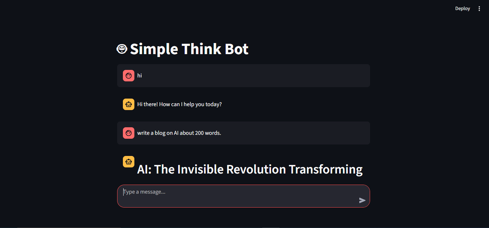
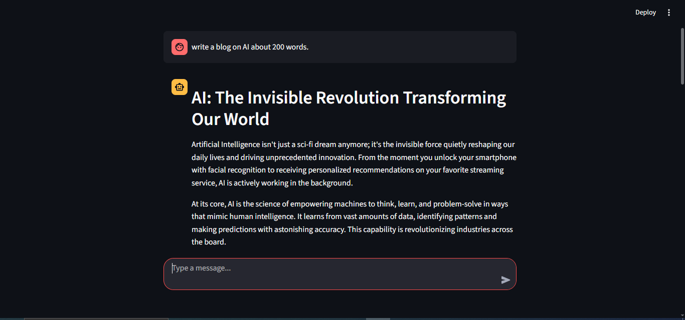
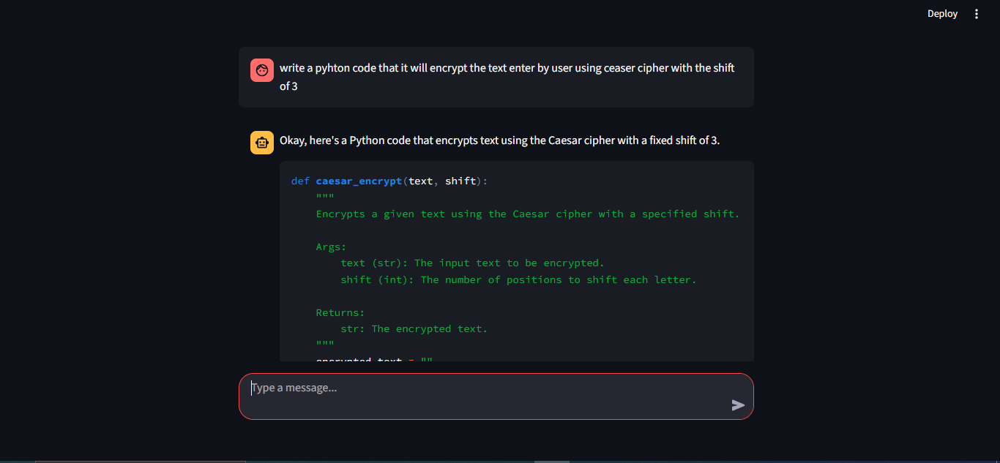
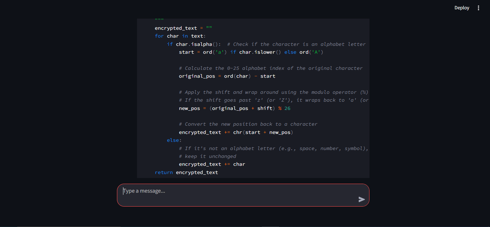
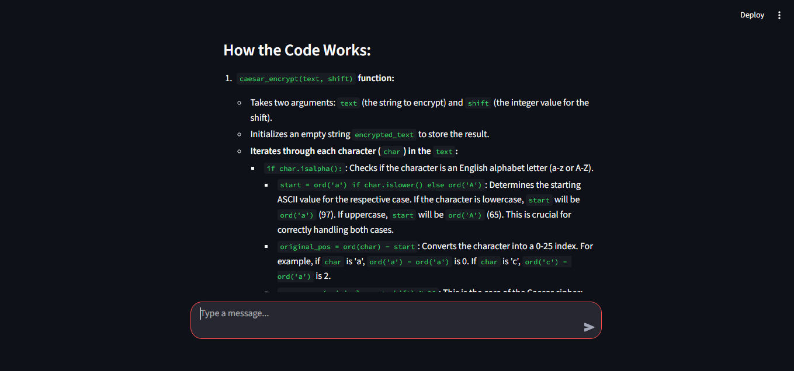

# 🤖 Gemini Streamlit Chatbot

A simple AI chatbot built using Google Gemini API and Streamlit.  
It provides real-time responses with a smooth typing animation for a better user experience.

---

## 🚀 Features

- 💬 Real-time AI chat responses
- ⚡ Fast and lightweight
- 🎨 Clean Streamlit UI
- ⚪ Typing animation effect
- 🔐 Secure API key handling using `.env`

---

## 🛠️ Tech Stack

- Python 🐍  
- Streamlit 🌐  
- Google Gemini API 🤖  
- dotenv 🔐  

---

## 📸 Project Screenshots

### 🖥️ Chat Interface


### 💬 User Message Example


### 🤖 AI Response


### ⚡ Typing Animation


### 🎯 Final Output View


---

## ⚙️ Installation & Setup

### 1️⃣ Clone the repository
```bash
git clone https://github.com/your-username/gemini-streamlit-chatbot.git
cd gemini-streamlit-chatbot
